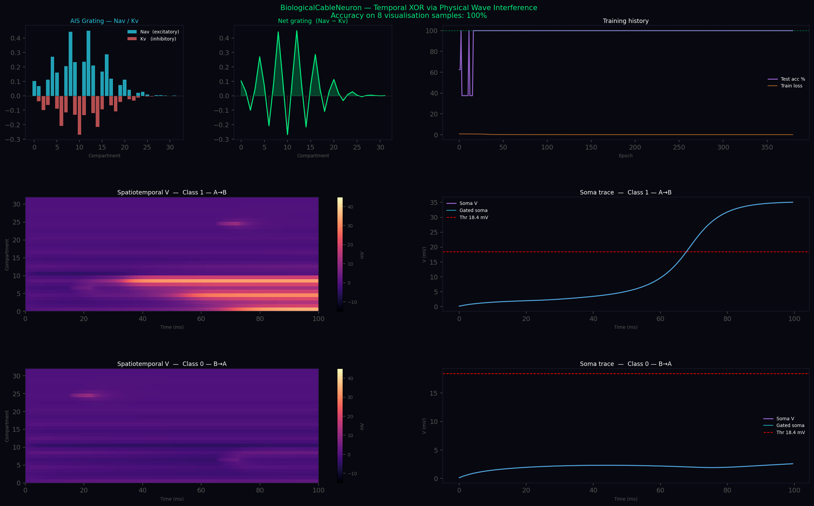

# ShadyStuff

**Nothing here. Move on.**  
*(...unless you're into geometric neurons, wave interference, and shady speculation.)*

Just a small personal dump of experimental code and musings on **geometric/biological neurons**, cable theory, and the idea of the **axon initial segment (AIS) as a dynamic projector / diffraction grating**.

---

## What's Inside

- **`cable_neuron.py`** — The main working piece.  
  A clean, runnable PyTorch implementation of a 1D biological cable neuron (32 compartments) with:
  - Semi-implicit (IMEX) solver for the cable equation
  - Learnable geometry (diameter + leak profile)
  - **AIS grating** — spatially modulated Nav (excitatory) and Kv (inhibitory) conductances with cosine periodicity + Gaussian envelope
  - Gamma-frequency gating on the soma
  - Trained on a **temporal XOR** task (order of two pulses matters)

  This task requires genuine **physical wave interference** and nonlinear channel dynamics. A linear Fourier synthesizer or simple point neuron cannot solve it.

- **`spikestogeometry.py`** — Early/experimental bridge from spikes to geometric representations.

- **Text files**:
- 
  - `Axon as projector idea musings by 3 ais.txt`
  - `claude musing on axon initial segment as projector.txt`
  - `note on cable neuron results.txt` (training logs + observations)

- **`membrane_geometry_thesis_v2.md.pdf`** — Speculative longer document (mostly Claude-generated).

---

## Key Result (Temporal XOR via Physics)

The model reliably reaches **100% accuracy**.  

The discrimination emerges from **spatiotemporal voltage wave interference** along the cable. The learned AIS grating acts as a tuned readout that converts different interference patterns (A→B vs B→A) into distinct soma responses.

**See** `cable_neuron.png` (generated by the script) for:



- The learned AIS Nav/Kv grating
- Spatiotemporal voltage fields for both classes
- Soma traces showing clear separation

### Example output

Temporal XOR requires physical wave interference.
A linear Fourier synthesizer cannot solve this task.
The cable nonlinearity is the computation.

## Philosophy / Bigger Picture

This repo explores the idea that **much of neural computation is embodied in geometry and wave physics** rather than purely in abstract synaptic weights:
- Dendrites as wave medium / interference field
- AIS as dynamic spectral filter / projector
- Molecular geometry at synapses as the finest-scale preprocessor (speculative extension)

Heavily inspired by cable theory, AIS plasticity biology, and holographic/resonant computing ideas.

---

## Running It

```bash
pip install torch torchvision torchaudio matplotlib  # (CUDA version recommended)
python cable_neuron.py
```

The script will train the model and save cable_neuron.png.

License
MIT — feel free to use, modify, or steal ideas.

Warning: This is "ShadyStuff" for a reason.
Highly speculative. Toy-scale physics-informed model. Lots of hand-waving at bigger implications.
But the core cable + AIS grating demo works surprisingly well.
